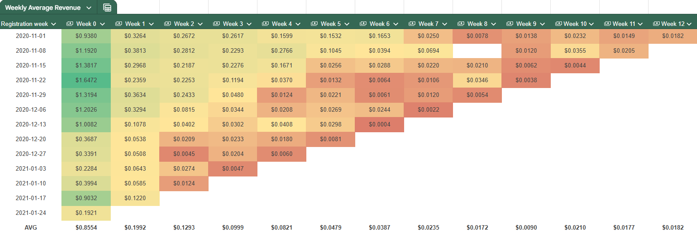
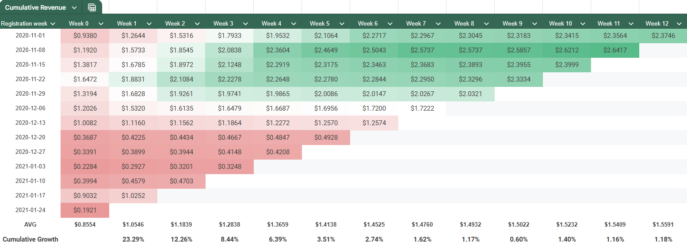
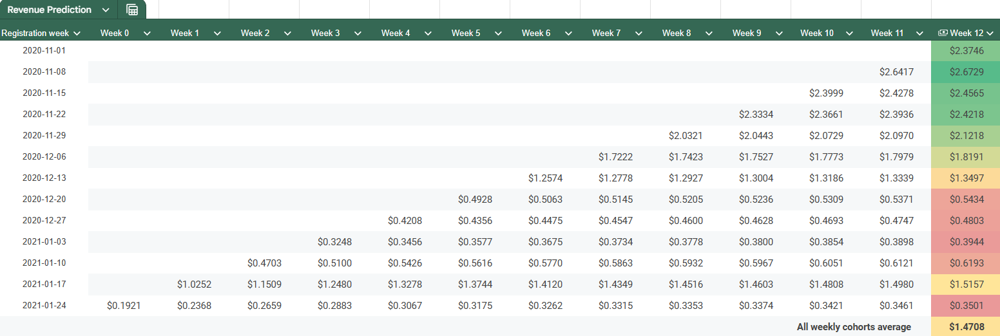

# Customer Lifetime Value (CLV) Analysis Using Weekly Cohort Data

## Project Overview

The primary goal of this analysis was to calculate current CLV for users who have interacted with the website, including those who have not made a purchase, using a 12-week cohort analysis. This cohort-based approach aims to offer a more nuanced view of revenue retention over time compared to the traditional CLV calculations.

Since this was a learning task, it’s scoped to be a quick analysis rather than a comprehensive project.

## Dataset Information

This project was developed using a proprietary dataset provided for educational purposes, which is not included in the repository due to restrictions. Redistribution or commercial use of the project contents is not permitted.

Key columns in the dataset include:
- **"user_pseudo_id"** - anonymized identifier for users to track sessions without personally identifying information.
- **"event_date"** - the date of each event or interaction by the user on the platform, recorded in the format `YYYYMMDD`.
- **"purchase_revenue_in_usd"** - revenue generated from purchases made by the user. If the user did not make a purchase, this field is `null`.

It also had additional columns, but they were not used in analysis. If you'd like to replicate the analysis, you may substitute with a similar dataset.

## Objectives

1. **Calculate Weekly Average Revenue per Cohort** - generate weekly revenue divided by registrations for each cohort. Since the dataset did not have explicit registration data, the first visit to the website was used as the registration date.
2. **Create Cumulative Revenue by Cohorts** - sum the weekly revenue for each cohort to produce a cumulative revenue view, providing a clear picture of revenue retention over time.
3. **Predict Future Revenue** - forecast revenue for recent cohorts to estimate expected future CLV based on average cumulative growth rates.

## Tech Stack

- **SQL** (BigQuery) – for data extraction and calculations.
- **Google Sheets** – for creating quick visualizations and additional calculations.

## Key Findings

### Weekly Average Revenue

    

- Most cohorts reach their highest revenue in the first 1-2 weeks, indicating strong initial engagement.
- Revenue generally decreases over time, highlighting the importance of early retention strategies.
- In 2020 November cohorts maintain revenue slightly better, possibly due to seasonal promotions.

### Cumulative Revenue

    

- Earlier cohorts from 2020 tend to show higher cumulative revenue, suggesting greater long-term value of those users.
- Users who started purchasing during the Holiday period of Christmas have lowest cumulative revenue for now. It could be just a post-holiday plunge, because customers tend to purchase a lot of things, like gifts, before main holidays. Afterwards, sales for many business tend to slow down for a while. 

### Revenue Prediction

    

- Cohorts with higher initial revenue show stronger future growth.
- Revenue prediction for users acquired in post holiday period is way lower, from above 2$ to around 0.5$. 

## Recommendations

1. **Enhance early engagement strategies** 

    Since most cohorts reach peak revenue in the first 1-2 weeks, implement targeted onboarding and personalized offers to capitalize on this early engagement period. Offering limited-time discounts or exclusive content during these initial weeks could improve user retention and increase long-term value.

2. **Introduce post-holiday retention campaigns**

    Revenue prediction and cumulative data suggest a post-holiday dip, especially for cohorts registered around the Christmas period. Implement retention campaigns tailored for post-holiday engagement, such as loyalty rewards or reminders, to mitigate the usual drop in spending after major holidays.

3. **Prioritize High-Value Cohorts for Upselling**

    Earlier cohorts and those with high initial revenue show stronger growth potential over time. Consider focusing upselling efforts on these high-value users, as they are more likely to respond positively to new offers or product recommendations.

4. **Future analysis: compare LTV to CAC ratio**

    For future analysis, it would be valuable to compare the LTV of profit to the Customer Acquisition Cost (CAC) ratio. This comparison would help in understanding how much the LTV to CAC ratio fluctuates over time, providing insights into the efficiency of acquisition efforts and the profitability of different user cohorts.

## How to Use This Repository

1. **"SQL_weekly_revenue"** - SQL query for CLV cohorts calculation.
2. **"images"** - visualizations from Google Sheets are provided as screenshots in this folder.
3. [**Google Sheet**](https://docs.google.com/spreadsheets/d/16U1iYErLgmiVYDPSGx8CtZ9Sc8HQgiHWO8YwJfaGOMw/edit?usp=sharing) - contains all tables with their additional calculations. 

## Contact

LinkedIn - [Agnė Vabalaitė](www.linkedin.com/in/agnė-vabalaitė).
Gmail - vab.agne@gmail.com